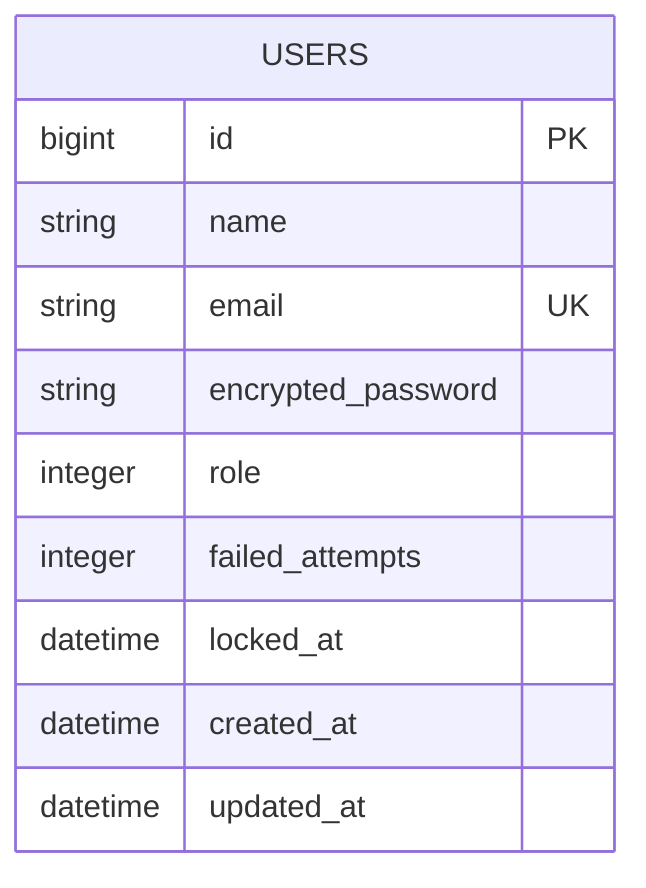

# 基本設計書

## 1. 概要
本システムは、研修で作成するユーザー管理システムである。  
ログイン機能、ログアウト機能、管理者によるユーザー管理機能を提供する。

## 2. 画面設計

| 画面名 | URL | 利用者 | 概要 |
|---|---|---|---|
| ログイン画面 | `/users/sign_in` | 未ログインユーザー | メールアドレスとパスワードでログインする |
| ユーザー詳細画面 | `/users/:id` | 一般ユーザー / 管理者ユーザー | ユーザー情報を確認する |
| ユーザー一覧画面 | `/users` | 管理者ユーザー | 登録済みユーザーを一覧表示する |
| ユーザー新規作成画面 | `/users/new` | 管理者ユーザー | ユーザーを新規作成する |
| ユーザー編集画面 | `/users/:id/edit` | 管理者ユーザー | ユーザー情報を編集する |

## 3. 機能設計

| 機能 | 概要 |
|---|---|
| ログイン機能 | メールアドレスとパスワードでログインする |
| ログアウト機能 | ログイン状態を終了する |
| ログイン状態管理 | ログイン中のユーザーを判定する |
| ログイン失敗回数制御 | 一定回数ログインに失敗した場合、アカウントを一時的にロックする |
| ユーザー一覧表示 | 管理者が登録済みユーザーを確認する |
| ユーザー詳細表示 | ユーザー情報を表示する |
| ユーザー新規作成 | 管理者がユーザーを作成する |
| ユーザー編集 | 管理者がユーザー情報を編集する |
| ユーザー削除 | 管理者がユーザーを削除する |
| バリデーション | 入力不備がある場合、登録・更新を行わない |

## 4. 権限設計

| 利用者区分 | 利用可能な画面・機能 |
|---|---|
| 未ログインユーザー | ログイン画面のみ |
| 一般ユーザー | 自身のユーザー詳細画面のみ |
| 管理者ユーザー | ユーザー一覧、詳細、新規作成、編集、削除 |

権限は `users` テーブルの `role` により判定する。  
`role` は `member` と `admin` の2種類とする。

## 5. テーブル定義

### usersテーブル

| カラム名 | 型 | 制約 | 説明 |
|---|---|---|---|
| id | bigint | 主キー | ユーザーID |
| name | string | NOT NULL | ユーザー名 |
| email | string | NOT NULL / UNIQUE | メールアドレス |
| encrypted_password | string | NOT NULL | ハッシュ化されたパスワード |
| role | integer | NOT NULL | `member` / `admin` の区分 |
| failed_attempts | integer | default: 0 | ログイン失敗回数 |
| locked_at | datetime | NULL可 | アカウントロック日時 |
| created_at | datetime | NOT NULL | 作成日時 |
| updated_at | datetime | NOT NULL | 更新日時 |

## 6. ER図

